# PolyMD - An AI-powered chatbot that enables researchers and engineers to query polymer property data through natural language conversations

## Overview

**PolyMD** is a retrieval-augmented generation application for asking
natural-language questions about polymer molecular dynamics (MD) data. It helps
users retrieve property values, paper-level context, DOI citations,
force-field information, and local molecular-tool results through a Streamlit
chat interface.

The system solves a common scientific information-access problem: polymer data
is often spread across spreadsheets, paper abstracts, force-field annotations,
and chemical identifiers. PolyMD combines structured chunk generation, hybrid
retrieval, grounded answer synthesis, and RDKit tooling so users can
query that information conversationally while still seeing evidence and
citations.

**This is my final project for CSC 7644: Applied LLM Development.**

## Functional Capabilities

### Key Features

- **RAG-based Q&A:** Answers polymer property, force-field, and literature
  questions using retrieved evidence from the local PolyMD corpus.
- **Dual-chunk corpus:** Uses property-level chunks for precise numeric lookup
  and paper-level chunks for abstract/literature context.
- **Hybrid retrieval:** Combines OpenAI embeddings in ChromaDB with BM25 lexical
  retrieval for better behavior on acronyms, polymer names, DOIs, and property
  terms.
- **Intent-aware filtering:** Routes property, comparison, force-field, and
  paper queries through different retrieval filters.
- **Comparison safeguards:** Adds alignment checks so the model does not compare
  unrelated properties as if they were a single scientific axis.
- **Abstention support:** Returns a safe refusal when retrieval confidence is
  too low or the corpus lacks relevant evidence.
- **Structured LLM output:** Uses JSON-schema-constrained OpenAI responses with
  answer text, evidence snippets, DOI links, confidence, and abstention fields.
- **Contextual source tracking:** Rewrites follow-up questions such as "that
  property," "the previous result," or "how was that calculated?" into
  source-aware standalone queries using the prior entity, property, value, and
  DOI citations.
- **Source-aware follow-up retrieval:** For contextual follow-ups, retrieval
  first prefers chunks from the DOI(s) and value cited in the previous answer
  before falling back to a fresh search.
- **Structured numeric comparisons:** Dataset-wide density comparisons such as
  "higher than that" scan all processed property records instead of relying on
  top-k retrieval snippets.
- **Deterministic dataset summaries:** Corpus-level questions such as paper
  counts and force-field inventories are computed from processed metadata, not
  estimated from the retrieved top-k context window.
- **Chat controls:** The sidebar supports downloading chat history as JSON,
  clearing the current chat, and clearing cached app resources.
- **Natural-language RDKit tool-use:** Lets users ask for structures in plain
  language, resolves chemical names through PubChem, and uses RDKit for SMILES
  canonicalization, descriptors, similarity, and 2D molecular rendering.
- **Evaluation harnesses:** Provides a lightweight golden-set evaluator and a
  195-question PolyMD benchmark kit that measure retrieval, DOI grounding,
  answer values, abstention behavior, and latency.
- **Unit tests:** Includes focused tests for retrieval helpers, lexical index
  loading, entity matching, filtering, and generator coercion.

## Technical Architecture

### Tech Stack

- **Language:** Python 3.9+
- **Frontend:** Streamlit
- **LLM API:** OpenAI Chat Completions
- **Generation model:** `gpt-4o-mini` by default
- **Embedding model:** `text-embedding-3-small` by default
- **Vector store:** ChromaDB persistent local collection
- **Sparse retrieval:** `rank-bm25`
- **Data processing:** pandas, openpyxl
- **Optional chemistry tools:** RDKit via `rdkit-pypi`
- **Testing:** pytest


### High-Level Components

- **Streamlit frontend:** `app.py` manages chat state and delegates rendering to
  `src/ui/`.
- **Application service layer:** `src/app_services.py` builds the RAG system and
  processes each query through RDKit or retrieval/generation.
- **Data loaders:** `scripts/data_processor.py` converts source spreadsheets
  into property and paper chunks.
- **Vector indexing:** `scripts/build_vectordb.py` embeds chunks with OpenAI and
  stores them in ChromaDB.
- **Retriever:** `src/retriever.py` performs intent inference, query
  normalization, vector search, BM25 search, hybrid fusion, comparison handling,
  confidence scoring, and abstention decisions.
- **Generator:** `src/generator.py` prompts OpenAI with retrieved evidence and
  enforces a structured JSON response.
- **Tool controller:** `src/controller.py` routes RDKit-capable user queries.
- **RDKit tools:** `src/rdkit_tools.py` contains deterministic local chemistry
  executors and sandboxed image rendering.
- **Evaluation:** `scripts/evaluate.py` measures retrieval hit rate, chunk-type
  match rate, abstention behavior, and latency against `data/golden_set.jsonl`.

### Project Architecture

PolyMD uses a two-stage architecture: an offline indexing pipeline prepares the
PolyMD corpus, and an online chat pipeline answers user questions from that
prepared state. The offline path converts spreadsheet records into
property-level and paper-level chunks, embeds those chunks with OpenAI, stores
them in ChromaDB, and writes a BM25 lexical snapshot. The online path starts in
Streamlit, delegates routing to `src.app_services.process_query()`, and then
chooses the safest available route for the user request.

At runtime, deterministic routes answer questions that should not depend on
top-k retrieval, such as dataset-level paper counts, force-field inventories,
and structured density comparisons. Chemistry tool requests are routed through
`ToolController`, which resolves names through PubChem when needed and executes
local RDKit operations. Remaining corpus questions flow through the hybrid
retriever, which combines Chroma vector search and BM25 lexical search, appends
parent paper context when useful, and passes grounded evidence to the
structured response generator.

<p align="center">
  <br>
  <em>Figure: Complete PolyMD RAG Architecture</em>
</p>

## Setup Instructions

### Prerequisites

- Python 3.9 or newer
- macOS, Linux, or Windows with a working Python environment
- OpenAI API key
- Network access for installing dependencies, building embeddings, generating
  answers, and optional PubChem name resolution

RDKit support is included in `requirements.txt` through `rdkit-pypi`. If RDKit
installation fails on your platform, the core RAG application can still run, but
RDKit-specific commands will return a clear tool error.

### Installation

From a fresh machine:

```bash
git clone <repository-url>
cd polymd-chatbot
python3 -m venv .venv
source .venv/bin/activate
python -m pip install --upgrade pip
pip install -r requirements.txt
```
The above was tested on MAC OS before publising to github.

On Windows PowerShell, activate the environment with:

```powershell
.\.venv\Scripts\Activate.ps1
```

### Configuration

Create a local environment file:

```bash
cp .env.example .env
```

Edit `.env` and set:

```bash
OPENAI_API_KEY=your_openai_api_key_here
```

Optional environment variables:

```bash
EMBEDDING_MODEL=text-embedding-3-small
LLM_MODEL=gpt-4o-mini
TOP_K=5
RETRIEVER_MODE=hybrid
HYBRID_ALPHA=0.65
SIMILARITY_THRESHOLD=0.5
ABSTAIN_MIN_TOP_SCORE=0.30
ABSTAIN_MIN_CONFIDENCE=0.40
TEMPERATURE=0.2
MAX_TOKENS=500
EMBEDDING_BATCH_SIZE=32
SHOW_LANDING_PAGE=true
```

Secrets are loaded from environment variables through `python-dotenv`. The
repository intentionally ignores `.env` and generated runtime artifacts.

### Data Preparation

The repository includes processed chunk files under `data/`. If you need to
regenerate them from the source spreadsheets:

```bash
python scripts/data_processor.py
```

Custom paths are also supported:

```bash
python scripts/data_processor.py \
  --polymd-path data/polymd_dataset.xlsx \
  --abstracts-path data/198_paper_doi_title_abstract.xlsx \
  --output-dir data
```

### Build the Vector Database

Before launching the app on a fresh checkout, build the local ChromaDB index:

```bash
python scripts/build_vectordb.py --reset
```

This command:

- loads `data/polymer_chunks.json`
- generates OpenAI embeddings
- writes a Chroma collection under `chroma_db/`
- writes an optional BM25 lexical snapshot at `data/lexical_index.json.gz`

The generated `chroma_db/` directory is intentionally ignored by Git because it
is reproducible from the chunk data and the configured embedding model.

### Run the Web App

```bash
streamlit run app.py
```

Streamlit will print a local URL, usually:

```text
http://localhost:8501
```

Example prompts:

- `What is molecular dynamics?`
- `What are force fields?`
- `What are different polymer properties studied in this dataset?`
- `What properties are studied for PMMA?`
- `What is polyethylene?`
- `What force fields were used for PET?`
- `Papers about polymer crystallinity`
- `Show me the structure of polystyrene`
- `Draw styrene`
- `What does C=CC1=CC=CC=C1 look like?`
- `rdkit: descriptors CCO`
- `rdkit: render CCO`

### Run Tests

```bash
python -m pytest -q
```

### Run Evaluation

```bash
python scripts/evaluate.py
```

With generation included:

```bash
python scripts/evaluate.py --with-generation --limit 10
```

Reports are written to `reports/`

### Run PolyMD Benchmark

The repository also includes a larger PolyMD benchmark kit with 195
dataset-specific questions covering property lookup, source lookup,
comparisons, contextual follow-ups, dataset summaries, force-field inventories,
and abstention behavior.

Generate predictions through the local PolyMD adapter:

```bash
python polymd_benchmark_complete_kit/scripts/run_benchmark.py \
  --mode module \
  --module-path polymd_benchmark_complete_kit/examples/polymd_adapter.py \
  --gold polymd_benchmark_complete_kit/data/polymd_benchmark_golden_set.jsonl \
  --out reports/polymd_benchmark_predictions.jsonl
```

Evaluate and render a Markdown report:

```bash
python polymd_benchmark_complete_kit/scripts/evaluate_polymd_benchmark.py \
  --gold polymd_benchmark_complete_kit/data/polymd_benchmark_golden_set.jsonl \
  --pred reports/polymd_benchmark_predictions.jsonl \
  --out reports/polymd_benchmark_eval.json

python polymd_benchmark_complete_kit/scripts/make_report.py \
  --eval-json reports/polymd_benchmark_eval.json \
  --out reports/polymd_benchmark_report.md
```

## Repository Map

```text
polymd-chatbot/
|-- app.py                         # Thin Streamlit entrypoint
|-- src/
|   |-- app_services.py            # System construction and query orchestration
|   |-- config.py                  # Environment-driven configuration
|   |-- controller.py              # RDKit routing layer
|   |-- embeddings.py              # OpenAI embedding client wrapper
|   |-- entity_match.py            # Token-safe entity matching helpers
|   |-- generator.py               # Structured LLM answer generation
|   |-- lexical_index.py           # BM25 snapshot persistence
|   |-- rdkit_tools.py             # Local chemistry tools
|   |-- retrieval_filters.py       # Pure retrieval payload transforms
|   |-- retriever.py               # Hybrid retrieval and abstention logic
|   |-- vector_store.py            # ChromaDB persistence/query wrapper
|   `-- ui/
|       |-- rendering.py           # Streamlit answer/landing-page rendering
|       `-- styles.py              # Streamlit CSS helpers
|-- scripts/
|   |-- build_vectordb.py          # Build ChromaDB and lexical snapshot
|   |-- data_processor.py          # Spreadsheet-to-chunk preprocessing
|   |-- evaluate.py                # Golden-set evaluation harness
|   `-- run_rdkit_agent.py         # RDKit tool CLI
|-- polymd_benchmark_complete_kit/
|   |-- data/                      # 195-question benchmark golden set
|   |-- examples/                  # PolyMD adapter and integration examples
|   |-- scripts/                   # Benchmark runner, evaluator, report writer
|   |-- README.md
|   `-- RUBRIC.md
|-- docs/
|   `-- architecture_flowchart.svg
|-- tests/                         # pytest unit tests
|-- data/
|   |-- polymd_dataset.xlsx
|   |-- 198_paper_doi_title_abstract.xlsx
|   |-- polymer_chunks.json
|   |-- property_chunks.csv
|   |-- paper_chunks.csv
|   `-- golden_set.jsonl
|-- .streamlit/config.toml         # Streamlit theme/server config
|-- .env.example                   # Environment variable template
|-- requirements.txt               # Python dependencies
|-- pytest.ini                     # pytest configuration
`-- README.md                      # Primary technical documentation
```

## Compliance & Credits

### Attributions

This project uses the following external libraries and services:

- OpenAI API for embeddings and chat completion generation.
- ChromaDB for local vector persistence and nearest-neighbor retrieval.
- `rank-bm25` for sparse lexical retrieval.
- Streamlit for the web application interface.
- pandas and openpyxl for spreadsheet processing.
- RDKit via `rdkit-pypi` for optional molecular operations.
- PubChem PUG REST for optional name-to-SMILES resolution. The app throttles
  resolver calls below PubChem's 5 requests/second usage guidance and handles
  temporary 503/non-JSON service responses with user-facing retry messages.
- pytest for unit testing.

No external application repository or tutorial code is intentionally copied into
this project. Standard library usage and library API calls follow public
documentation for the dependencies listed above.

The included `polymd_benchmark_complete_kit/` is a local benchmark artifact for
this project. It evaluates the PolyMD-specific RAG behavior, not an external
chemistry benchmark.